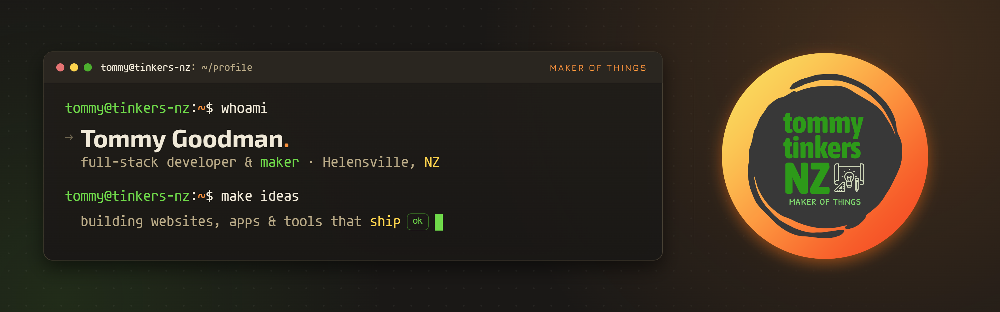

<!-- ============================================================ -->
<!--  tommy tinkers NZ · GitHub profile README                    -->
<!--  Banner lives at assets/banner.png in this repo.             -->
<!-- ============================================================ -->

  

  
  &nbsp;
  
  &nbsp;
  

---

## `tommy@tinkers-nz:~$ whoami`

Hi, I'm Tommy. A full-stack developer and maker based in Helensville, New Zealand.

I build websites, apps, and small tools that solve real problems, then I make sure they actually ship. I like clean code, tidy automation, and documentation the next person can follow. When the keyboard cools down I'm usually out in the workshop, tinkering with hardware, 3D printers, and anything with a motor in it.

- `~` based in Helensville, NZ
- `~` full-stack, front to back
- `~` honest about what I know
- `~` always mid-project

---

## `tommy@tinkers-nz:~$ ls ./in-the-wild`

  
  
  
  

---

## `tommy@tinkers-nz:~$ git log --featured`

A few things I've made that I'm happy to point at.

| Project | What it is | Built with |
| --- | --- | --- |
| **[tommytinkers.nz](https://tommytinkers.nz)** | My freelance front door. A warm, simple, honest site for the people I build things for. | `React` · `Vite` |
| **[thomasgoodman.me](https://thomasgoodman.me)** | My developer portfolio. The workshop view, where I show the engineering side of what I do. | `React` · `Vite` |
| **[whenuapai-key-press-manager](https://github.com/tonkatommy/whenuapai-key-press-manager)** | A desktop key sign-out and audit system. Tracks who has which keys and when, built to replace a paper logbook. | `Java` · `JavaFX` |

---

## `tommy@tinkers-nz:~$ cat toolbox.json`

**Languages**

**Frameworks**

**Data & tools**

---

## `tommy@tinkers-nz:~$ gh stats --me`

<table>
  <tr>
    <td>
      
    </td>
    <td>
      
    </td>
  </tr>
</table>

<picture>
  <source media="(prefers-color-scheme: dark)" srcset="https://raw.githubusercontent.com/tonkatommy/tonkatommy/output/github-contribution-grid-snake-dark.svg" />
  <source media="(prefers-color-scheme: light)" srcset="https://raw.githubusercontent.com/tonkatommy/tonkatommy/output/github-contribution-grid-snake.svg" />
  
</picture>

---

## `tommy@tinkers-nz:~$ uptime --beyond-keyboard`

Away from the screen you'll find me on coastal walks and bush tracks around Aotearoa, out on the bike, or racing 1/10th scale RC cars. Winters mean snowboarding. Most days end with my partner, the kids, and one very good dog.

---

## `tommy@tinkers-nz:~$ ./say-hello.sh`

Got an idea that needs making? I'm always happy to talk shop.

  
  
  

 

  <b>tommy tinkers NZ</b> · maker of things · Helensville, Aotearoa

